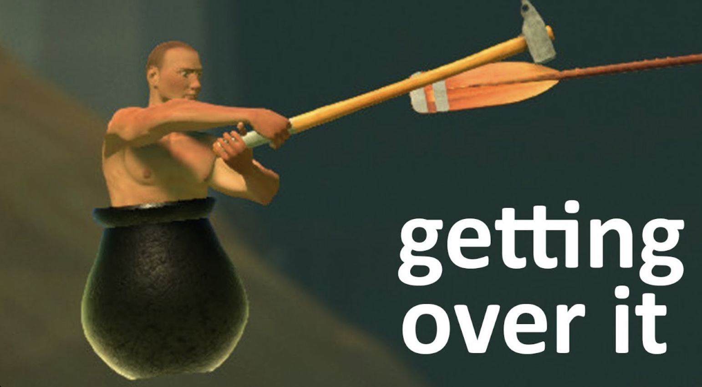

# IDEA9103 Group 4 — The Starry Night (Interactive)

## Inspiration

Our project is based on Vincent van Gogh's *The Starry Night* (1889). We were drawn to the painting's sense of movement — the swirling sky, restless ocean, and the contrast between the glowing celestial bodies and the dark landscape below. Rather than recreating the painting statically, we wanted to capture its emotional progression: from the calm of early evening (Reality), into the dreamlike distortion of night (Dream), through a cosmic expansion (Galaxy), and finally back to a gentle dawn (Awakening). The four phases reflect how van Gogh's brushwork itself seems to shift in intensity — from quiet to turbulent to transcendent.

The balance mechanic draws loosely from physics-based awkward-control games such as Bennett Foddy's Getting Over It (2017) and the classic marble-labyrinth tilt genre, where the gap between player intention and physical outcome creates tension. The cat's reactive expressions extend this tradition by adding an emotional feedback layer — the character becomes a mirror for the player's performance.

---

## Techniques

The project is built in p5.js and combines five distinct generative mechanics:

- **Time-based progression**: A `millis()`-driven timeline cycles through four phases over 70 seconds. Each phase triggers visual events at specific timestamps using an array of `{ time, event }` objects. The sun and moon animate using `lerp()` and a cubic easing function to move smoothly across the sky.
- **Wave horizon**: The ocean is drawn as a `beginShape()` polygon whose top edge follows a `sin()` wave — the horizon line itself is the wave, with no flat boundary between sky and ocean. Wave amplitude and frequency vary per phase.
- **Perlin noise & randomness**: Organic distortion and natural-looking fish/whale movement using `noise()` to make the scene feel alive rather than mechanical.
- **User input**: The user's mouse position controls a balance mechanic — the boat tilts in response to cursor movement, and a score tracks stability. The cat character reacts to the tilt angle in real time.
-**Audio response: A looping audio track is loaded via loadSound() in preload(). p5.Amplitude measures the RMS volume level every frame via getLevel(), which returns a value between 0 and 1. This value drives wave amplitude in drawOcean(), boat tilt in drawBoat(), and tail curl in drawCat() — the louder the music, the more turbulent everything becomes.
The sky and ocean gradients are drawn as stacked horizontal `line()` calls with `lerpColor()` for smooth colour blending. Phase transitions affect all visual parameters simultaneously.

### Time-based Mechanic Details (Xinyue Qiu)

The timeline is driven by `millis()` and a `timeOffset` variable. An array called `timeline` stores objects with `time` (milliseconds since phase start) and `event` (a string label). At each `draw()` call, the current time `t = millis() - timeOffset` is compared against the timeline to decide which phase and which event is active.

**Four phases:**

| Phase | Time range | Sky | Ocean | Sun/Moon |
|---|---|---|---|---|
| Reality | 0–15000 ms | Bright blue to deep blue | Calm waves, low amplitude | Sun rises from horizon, golden |
| Dream | 15000–35000 ms | Deep blue to purple | Medium waves | Sun sets, moon rises, stars appear |
| Galaxy | 35000–55000 ms | Purple to black | Chaotic waves, high amplitude | Moon glows bright, stars swirl |
| Awakening | 55000–70000 ms | Black to warm dawn | Calm returning | Moon fades, sun returns |

**Key functions:**
- `drawSky(stage)` — fills the entire canvas height with a vertical gradient using `lerpColor()`. The `stage` parameter selects which colour pair to use.
- `drawOcean(stage)` — draws a polygon using `beginShape()` and `vertex()`. The top edge is a `sin()` wave; the bottom edge is the canvas bottom. This makes the wave itself the horizon line.
- `drawSun(stage)` / `drawMoon(stage)` — use `easeOutCubic()` for smooth entry animation. The sun and moon positions are calculated with `lerp()` between start and end Y positions.
- `drawStars(stage)` — stars fade in during Dream phase and swirl (slight position drift) during Galaxy phase.
- `handleEvent(event)` — dispatches colour changes, wave parameter updates, and celestial transitions based on the current event string.
- `easeOutCubic(t)` — a cubic easing function: `1 - pow(1 - t, 3)`. Makes animations start fast and slow down at the end.

**Wave parameters per phase:**
- `waveAmplitude`: 15 (Reality) → 25 (Dream) → 40 (Galaxy) → 15 (Awakening)
- `waveFreq`: 0.02 (Reality) → 0.03 (Dream) → 0.05 (Galaxy) → 0.02 (Awakening)
- `waveSpeed`: controlled by `frameCount * 0.03` (Reality/Dream/Awakening) or `frameCount * 0.05` (Galaxy)

The phase transition is seamless — `drawSky()` and `drawOcean()` are called every frame, and the `stage` variable determines which colour scheme and wave parameters are active.

### Audio-Reactive Ocean Details (Anusha Jaiswal)

Sound was always in the painting, I just needed to find it. The ocean does not sit flat, it churns and rolls, restless in a way that always felt like it had a rhythm underneath. I wanted to make that rhythm audible, and then let it work the other way: let sound become the ocean.

The mechanic uses p5.sound's `Amplitude` analyser to read the live volume of a looping audio track every frame. That single number — how loud the music is right now — gets mapped onto everything that moves in the water. When the track swells, the waves surge upward, their amplitude multiplying with the sound. When it quiets, they settle back. The ocean breathes with the music.

It does not stop at the water. The boat feels it too. Loud moments push extra tilt into the hull, so the cat on deck has to fight the music as well as its own weight. The cat's tail responds independently, curling tighter and higher as the volume climbs, relaxed and loose when things are calm. It is a small detail but it makes the animal feel present, aware of something the viewer can hear.

The audio starts on the first click anywhere on the canvas. A small prompt at the bottom edge guides the viewer in. After that it loops and the painting stays in motion, the ocean never quite the same shape twice.

### User Input Key funcation(Danlin Liu):

Key functions:

drawBoat(stage) — draws the wooden boat hull using bezierVertex() for the curved shape, with plank lines and bench seats as detail. Applies push()/translate()/rotate(boatTilt)/pop() to tilt the entire boat around its centre. Calls drawCat() and drawBalanceBar() at the end.
drawCat(px, py) — draws a sitting cat with triangular ears, whiskers, and a curling tail using ellipse(), triangle(), and sin() for tail animation. The cat's facial expression changes with boatTilt: a smile when balanced (abs(boatTilt) < 0.05), a neutral line when slightly tilted, and a worried open mouth with a sweat drop when severely tilted (abs(boatTilt) > 0.15).
drawBalanceBar() — draws a horizontal progress bar at the top of the canvas. The fill colour transitions from green to yellow to red as balanceScore drops, using lerpColor() logic with threshold checks (> 70, > 40, < 40).
handleEvent(event) — the user input mechanic responds to phase changes triggered by the timeline. During the Galaxy phase (35000–55000 ms), waveAmplitude increases, which amplifies naturalRock and makes balancing harder.
The cat is always drawn at width/2 + personX * 28, so the visual position matches the balance logic. The boat rotation pivot is the boat centre, so the cat stays correctly on deck as the boat tilts.

### Perlinoise Key Function （Yichen Yao）
Fish school. A school of fish drifts through the water, each one a different
size, shape, and colour. Their colours are drawn from the four phase backgrounds
(reality, dream, galaxy, awakening), so the school always stays in harmony with
whichever phase is showing — some fish blend in, others read as accents. The
fish also have a sense of depth: those "closer" to the viewer are larger, more
vivid, and faster, while those "further away" are smaller, faded, and slower,
giving the school a front-to-back sense of space. Each fish wanders up and down
its own gentle path and sways its tail with a soft delay, so the body curves into
an S-shape and reads as alive rather than rigid.

Whale. Now and then, a whale breaches at a random, rare moment. It arcs out
of the water and back down, moving quickly as it leaves the water, hanging for a
beat at the top, then speeding up as it falls. Its body is built from flat
colour facets shaded to suggest volume, with no outline, matching the scene's
calm, dreamlike style.

### Voice Frequency Function   (Yujing Zhang)
Seagulls. Groups of seagulls fly across the daytime sky. Each seagull has its own fixed moving speed. Their flying speed and wing flapping speed change along with the audio. When the audio signal becomes stronger, seagulls move faster and flap their wings more frequently. When seagulls fly out of the screen range, they will reappear on the opposite side and keep moving.
Rain and sea particles. When entering the rainy night scene, raindrops fall from the top of the screen. The falling speed of raindrops is affected by audio. Stronger audio makes raindrops drop faster. Raindrops near the bottom of the screen gradually turn transparent to create a layered visual effect. A large number of small glowing particles float on the sea surface. The size and brightness of these particles change with the audio as they move slowly.
Meteors. In the clear night scene, meteors appear randomly in the sky. The number and generation probability of meteors are controlled by audio. More meteors will appear when the audio is more active. Each meteor has a coloured trail and a bright point at the front. Meteors gradually become transparent and disappear during flight. Multiple colours are used for meteors to enrich the visual effect.

---

## Mechanic Ownership

**Xinyue Qiu — Time-based mechanic**
A 70-second timeline (`millis()` + `timeOffset`) cycles through four phases: **Reality** (bright, sun rises), **Dream** (purple, moon rises, stars appear), **Galaxy** (dark, chaotic waves, stars swirl), **Awakening** (dawn returns, sun reappears). A `timeline` array of `{ time, event }` objects triggers parameter changes at specific timestamps. `drawSky(stage)` fills the full canvas with a `lerpColor` vertical gradient. `drawOcean(stage)` draws a `beginShape()` polygon where the top edge is a `sin()` wave (the horizon is the wave itself). `drawSun()` and `drawMoon()` use `easeOutCubic()` for smooth entry animation. `drawStars()` handles star fade-in and swirl. Wave amplitude, frequency, and speed vary per phase.

**Danlin Liu — User input**
The user's mouse position controls a balance mechanic on a wooden boat. The boat tilts in real time in response to cursor movement, and a balance score tracks stability. A cat character on the deck reacts to the tilt angle with changing facial expressions and tail movement.

The mechanic uses three layered variables updated every frame. naturalRock generates a slow sinusoidal sway (sin(frameCount * 0.025) * 0.14) that simulates wave motion. personX maps the mouse X position to a normalised range (-1 to 1) and is smoothed with lerp() for gradual movement. boatTilt is the sum of naturalRock and the person's offset scaled by 0.28, also lerp()-smoothped. The balanceScore is derived from boatTilt using constrain() and lerp(), decreasing as the boat tilts further from centre.

**Yichen Yao — Perlin noise & randomness**
Randomness. `random()` sets each fish's size, body shape, position, speed,
and palette colour, so a single Fish class produces a varied school. A
`random()` depth value (z-axis) scales size, colour, and speed, and the school is
sorted by depth so far fish draw behind near ones. The whale spawns when
`random()` falls below a low probability each frame, making it rare and
unpredictable.
Perlin noise. Each fish carries its own `noise()` offset, which slowly drifts
its vertical swim lane up and down — the core use of Perlin noise, producing
smooth, never-repeating motion.
Motion. `sin()` drives the vertical bob, the delayed-phase tail sway (the
tail's phase lags the head), the whale's parabolic `arc (4t(1−t)`, with speed
tied to height, and the two wave bands in waves.js.
Drawing. Fish and whale bodies are flat faceted shapes built with
`beginShape()`/`vertex()`/`endShape(CLOSE)` and shaded in brightness bands using
colorMode(HSB) and fill(). The whale's mirrored tail flukes use
`push()`/`translate()`/`rotate()`/`scale`()/`pop()`. 

**Anna (Yujing Zhang)**
I create frame-by-frame visual effects driven by audio frequency analysed via p5.FFT.The function updateFrequency calculates the average audio frequency from the sound spectrum.
In the daytime scene：
map() converts audio frequency into movement and flapping speed for seagulls. The sin() function creates natural wing animation; higher frequency makes seagulls travel faster and flap their wings more rapidly.
In the rainy night scene ：
map() and constrain() adjust raindrop velocity. Higher audio frequency accelerates falling raindrops and enhances the rain effect.For the sea sparkle particles, sin() generates pulsating glow and floating motion, and particle size is affected by audio frequency.
In the clear night scene：
map(), constrain() and floor() control meteor spawn chance and quantity. Higher frequency increases the number of meteors.I use random() to initialise positions and properties of all dynamic elements, and array methods to manage seagulls, raindrops, particles and meteors.
#### Nush and I use the same audio source, yet our resulting visual presentations are completely different.

**Anusha Jaiswal — Audio mechanic**
The mechanic uses p5.sound's Amplitude analyser to read the live volume of a looping audio track every frame. That single number — how loud the music is right now — gets mapped onto everything that moves in the water. When the track swells, the waves surge upward. When it quiets, they settle back. The ocean breathes with the music.
Key variables:

song — loaded via loadSound() in preload(), looped on first canvas click
soundAnalyser — a p5.Amplitude instance created in setup() and connected to song via setInput()
audioVolume — updated every frame via soundAnalyser.getLevel(), range 0–1

Key functions and changes:

preload() — loads assets/song.mp3 using p5.sound's loadSound()
setup() — initialises p5.Amplitude, connects it to the song
draw() — calls soundAnalyser.getLevel() every frame and stores the result in audioVolume
drawOcean(stage) — the existing waveAmplitude variable is multiplied by (1 + audioVolume * 8) after the phase value is set, so loud moments scale the waves up to 8x their base height without overriding the phase system
drawBoat(stage) — audioVolume * 0.4 is added to targetTilt, so loud moments push the boat off balance independently of the mouse position. This means the cat has to fight both the viewer's input and the music at once
drawCat(px, py) — audioVolume * 8 is added to tailCurl, so the cat's tail curls dramatically upward during loud passages and relaxes during quiet ones. A small detail but it makes the animal feel reactive and alive
mousePressed() — on first click anywhere on the canvas, song.loop() is called. A small pill-shaped prompt at the bottom of the canvas reads "♪ click anywhere to start" and disappears once the song is playing

The audio track chosen is cinematic and dynamic, with clear loud and quiet passages, so the visual response feels intentional rather than random. The ocean never plays out the same shape twice.

---

## AI Acknowledgement

**Xinyue Qiu - Time-based mechanic**: AI assistance was used during the design and development of the time-based mechanic. AI was primarily used to help brainstorm scene transitions, refine the timeline structure, and troubleshoot implementation issues during coding. Suggestions related to event-driven architecture, animation timing, and visual transitions were reviewed, tested, modified, and integrated where appropriate. All final design decisions, code integration, debugging, and creative direction were completed by the author. Relevant AI-assisted sections are documented in sketch.js.

**Danlin Liu — user input**

AI assistance was used for: (1) designing the three-variable balance physics architecture (naturalRock, personX, boatTilt) and tuning the lerp() smoothing parameters for natural feeling movement; (2) implementing the cat character's reactive facial expressions and tail animation using sin() and conditional drawing based on boatTilt thresholds; (3) debugging a while loop issue in the timeline event system where loopToReality caused all remaining events to trigger in a single frame — the fix involved adding a shouldBreak flag to exit the loop after a phase reset. All generated code was read, understood, and commented in sketch.js before submission.

**Yichen Yao — Perlin noise & randomness**
I used Claude as a coding and design partner — to discuss ideas, draft and
iterate on code, and check that every function stayed within what was taught in
class. All design decisions, tuning, and final code were reviewed and decided by
me.

**（Anna）Yujing Zhang - voice frequency part**
I utilized AI tools for two key aspects of development: (1) generating initial code snippets relevant to sound frequency-driven visual interactions (including seagull movement, rainfall intensity, and meteor appearance dynamics); (2) seeking guidance on debugging and resolving technical bugs encountered during implementation. All AI-generated code was thoroughly read, understood, modified to align with the project’s interactive logic, and integrated into the final submission. Additionally, all design decisions, parameter tuning (e.g., frequency-response sensitivity, animation speed), and functional validation were independently reviewed and finalized by myself.

**Anusha Jaiswal- Audio volume part**
I used Claude as a coding assistant throughout this mechanic. I knew what I wanted — sound driving the ocean — but needed help with the p5.Amplitude setup and figuring out where exactly to place the audioVolume multiplier inside drawOcean() so it worked on top of the phase system rather than replacing it. Browser autoplay policy was a frustrating bug to track down; AI helped me understand why song.loop() in setup() gets blocked and pointed me toward mousePressed() as the fix. The multiplier values (* 8 for waves and tail, * 0.4 for boat tilt) were tuned by me through trial and error in the browser. All code was read and understood before it went in.

---

## External References

- Van Gogh, V. (1889). *The Starry Night* [Oil on canvas]. Museum of Modern Art, New York. — visual and conceptual source for all four phases.
- p5.js reference documentation: [https://p5js.org/reference/](https://p5js.org/reference/) — used throughout for `beginShape()`, `lerpColor()`, `map()`, `noise()`, and `millis()`.

---

## Interaction Instructions

1. **Open** `index.html` in a browser (or run via a local server).
2. **Click anywhere** on the canvas to start the background audio.
3. The animation starts automatically and cycles through four phases over 70 seconds, then loops.
4. **Move your mouse left and right** to control the boat's balance. Moving the cursor to the edges tilts the boat further; keeping it centred maintains balance.
5. Watch the **Balance bar** at the top — if the boat tilts too far, the score drops and the cat reacts.
6. The louder the audio, the bigger the waves — try turning up your volume.
